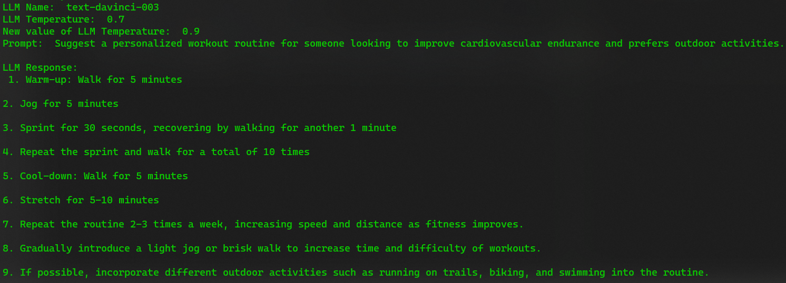
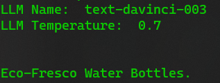
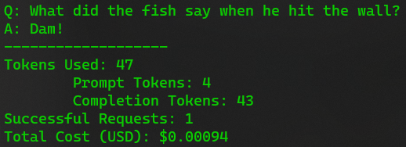
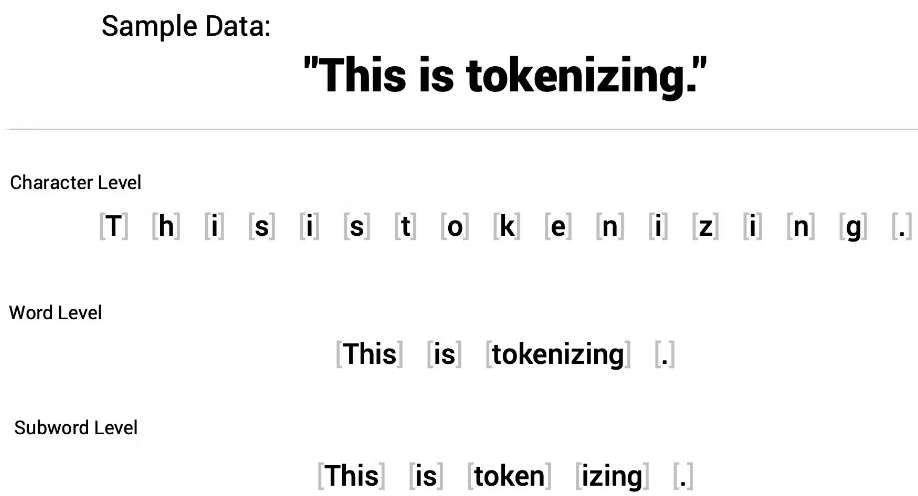

# Personalised Workout Routines  
  
## Simple Prompt to LLM (./scripts/script_1.py)  
- In this project, we are building a service that suggests personalised workout routines based on an individual's fitness goals and preferences.  
- Here, we are simply passing a prompt to the LLM and getting a response.  
- For the same, we are using the model 'text-davinci-003` and set the value of temperature to 0.9 from its default value of 0.7.  
- Following is the output of `./scripts/script_1.py`:  
  
  
## Use of `LLMChain` and `PromptTemplate` (./scripts/script_2.py)  
- In LangChain, a chain is an end-to-end wrapper around multiple individual components, providing a way to accomplish a common use case by combining these components in a specific sequence.  
- The most commonly used type of chain is the `LLMChain`, which consists of a `PromptTemplate`, a model (either an LLM or a ChatModel) and an optional output parser.  
- The `LLMChain` works as follow:  
    1. Takes (multiple) input variables  
    2. Uses the `PromptTemplate` to format the input variables into a prompt  
    3. Passes the formatted prompt to the model (either a LLM or a ChatModel)  
    4. If an `OutputParser` is provided, then it will be used to format the output (or response) from the model  
- Here, we will be creating a probject to generate a name for a company that manufactures eco-friendly water bottles. For the same, we will be using `LLMChain`, `PromptTemplate`, and `OpenAI` LLM model. Following is the output:  
  
  
## Use of `ConversationChain` and `ConversationBufferMemory` (./scripts/script_3.py)  
- In LangChain, `Memory` refers to the mechanism that stores and manages the conversation history between a user and the LLM model.  
- It helps mantain context and coherence throughout the interaction, enabling the LLM to generate more relevant and accurate responses.  
- `Memory`, such as `ConversationBufferMemory`, acts as a wrapper around `ChatMessageHistory`, extracting the messages and providing them to the chain for better context aware generation.  
- Following is the output of this script:  
```
LLM Name:  text-davinci-003
LLM Temperature:  0.7


> Entering new ConversationChain chain...
Prompt after formatting:
The following is a friendly conversation between a human and an AI. The AI is talkative and provides lots of specific details from its context. If the AI does not know the answer to a question, it truthfully says it does not know.

Current conversation:

Human: Tell me about the south pole in 50 words.
AI:

> Finished chain.


> Entering new ConversationChain chain...
Prompt after formatting:
The following is a friendly conversation between a human and an AI. The AI is talkative and provides lots of specific details from its context. If the AI does not know the answer to a question, it truthfully says it does not know.

Current conversation:
Human: Tell me about the south pole in 50 words.
AI:  The South Pole is a point on the Earth's surface that is the southernmost point of the planet. It is located in the Antarctic region, and is one of the two points at which the Earth's axis of rotation intersects with its surface. The South Pole is the coldest, driest, and windiest place on Earth, with temperatures reaching as low as -89.2°C. It is home to a permanent research station operated by the Antarctic Treaty System.
Human: How far North Pole is from South Pole in Kilometers?
AI:

> Finished chain.


> Entering new ConversationChain chain...
Prompt after formatting:
The following is a friendly conversation between a human and an AI. The AI is talkative and provides lots of specific details from its context. If the AI does not know the answer to a question, it truthfully says it does not know.

Current conversation:
Human: Tell me about the south pole in 50 words.
AI:  The South Pole is a point on the Earth's surface that is the southernmost point of the planet. It is located in the Antarctic region, and is one of the two points at which the Earth's axis of rotation intersects with its surface. The South Pole is the coldest, driest, and windiest place on Earth, with temperatures reaching as low as -89.2°C. It is home to a permanent research station operated by the Antarctic Treaty System.
Human: How far North Pole is from South Pole in Kilometers?
AI:  The North Pole and the South Pole are about 13,986 kilometers apart.
Human: Which of the two poles is good for vacation in 5 words?
AI:

> Finished chain.
memory=ConversationBufferMemory(chat_memory=ChatMessageHistory(messages=[HumanMessage(content='Tell me about the south pole in 50 words.', additional_kwargs={}, example=False), AIMessage(content=" The South Pole is a point on the Earth's surface that is the southernmost point of the planet. It is located in the Antarctic region, and is one of the two points at which the Earth's axis of rotation intersects with its surface. The South Pole is the coldest, driest, and windiest place on Earth, with temperatures reaching as low as -89.2°C. It is home to a permanent research station operated by the Antarctic Treaty System.", additional_kwargs={}, example=False), HumanMessage(content='How far North Pole is from South Pole in Kilometers?', additional_kwargs={}, example=False), AIMessage(content=' The North Pole and the South Pole are about 13,986 kilometers apart.', additional_kwargs={}, example=False), HumanMessage(content='Which of the two poles is good for vacation in 5 words?', additional_kwargs={}, example=False), AIMessage(content=' Neither - too cold!', additional_kwargs={}, example=False)]), output_key=None, input_key=None, return_messages=False, human_prefix='Human', ai_prefix='AI', memory_key='history') callbacks=None callback_manager=None verbose=True prompt=PromptTemplate(input_variables=['history', 'input'], output_parser=None, partial_variables={}, template='The following is a friendly conversation between a human and an AI. The AI is talkative and provides lots of specific details from its context. If the AI does not know the answer to a question, it truthfully says it does not know.\n\nCurrent conversation:\n{history}\nHuman: {input}\nAI:', template_format='f-string', validate_template=True) llm=OpenAI(cache=None, verbose=False, callbacks=None, callback_manager=None, client=<class 'openai.api_resources.completion.Completion'>, model_name='text-davinci-003', temperature=0.7, max_tokens=256, top_p=1, frequency_penalty=0, presence_penalty=0, n=1, best_of=1, model_kwargs={}, openai_api_key=None, openai_api_base=None, openai_organization=None, batch_size=20, request_timeout=None, logit_bias={}, max_retries=6, streaming=False, allowed_special=set(), disallowed_special='all') output_key='response' input_key='input'
```  
  
- In the above output, you can notice that the memory being used as after each input from the user, the conversation is updated with both the user's input and the AI's response. This way, the memory maintains a record of the entire conversation. When the AI generates its next response, it will use this conversation history as a context, making its responses more coherent and relevant.  
  
## Use of `Tool` and `agent` (./scripts/script_4.py)  
- DeepLake provides storage for embeddings and their corresponding metadata in the context of LLM apps. It enables hybrid searches on these embeddings and their attributes for efficient data retrieval.  
- It can also be integrate with LangChain for the development and deployment of applications.  
- Advantages of DeepLake:  
    1. Multimodal: It can store data of diverse modalities, such as text, images, videos, audio; along with their vector representation.  
    2. Serverless: We can create and manage cloud datasets without creating and managing a database instance. This gives a great speedup to projects.  
    3. Data Loader: We can easily create a data loader from DeepLake for the training / fine-tuning of Deep Learning models.  
- In order to use DeepLake, register on ActiveLoop's website and generate an API token. Save this DeepLake token in `ACTIVELOOP_TOKEN` environment variable.  
- Command to install DeepLake: `$ pip install deeplake`  
- In order to use DeepLake, make sure that you have a `ACTIVELOOP_TOKEN` defined in your environment variables.  
- Along with the `ACTIVELOOP_TOKEN`, you also have to login on terminal by running the following command:  
`$ activeloop login --token <your_activeloop_token>`  
  
- Following is the description of its code:  
    1. Make the following imports:  
    ```
    from langchain.llms import OpenAI
    from langchain.embeddings.openai import OpenAIEmbedding
    from langchain.text_splitter import RecursiveCharacterTextSplitter
    from langchain.vectorstores import DeepLake
    from langchain.chains import RetrievalQA
    from langchain.agents import initialize_agent, Tool, AgentType
    ```  
  
    2. Create an instance of OpenAI LLM and print the name of LLM and its temperature value:  
    ```
    llm = OpenAI()
    print("LLM Name: ", llm.model_name)
    print("LLM Temperature: ", llm.temperature)
    ```  
    3. Define the embeddings:  
        ```
        embeddings = OpenAIEmbeddings(model="text-embedding-ada-002")
        ```  
        - OpenAI's text embeddings measures the relatedness of text strings. Embeddings are commonly used for:  
            1. Search: Where results are ranked by relevance to a query string  
            2. Clustering: Where text strings are grouped by similarity  
            3. Recommendations: Where items with related text strings are recommended  
            4. Anomaly Detection: Where outliers with little relatedness are identified  
            5. Diversity Measurement: Where similarity distributions are analyzed  
            6. Classification: Where text strings are classified by their most similar label  
        - An embedding is a vector, i.e., a list of floating-point numbers. The distance between two vectors measures their relatedness.  
        - Small distance suggests high relatedness and large distance suggests low relatedness.  
        - OpenAI offers one second-generation embedding model (`text-embedding-ada-002`) and 16 first-generation embedding models.  
        - OpenAI recommends using `text-embedding-ada-002` (a second-generation embedding model) nearly for all use-cases.  
        | MODEL NAME             | TOKENIZER   | MAX INPUT TOKENS | OUTPUT DIMENSIONS |
        |------------------------|-------------|------------------|-------------------|
        | text-embedding-ada-002 | cl100k-base | 8191             | 1536              |  
          
    4. Define documents:  
    ```
    text = [
        "Napoleon Bonaparte was born in 15 August 1769.",
        "Louis XIV was born in 5 September 1638.",
    ]
    ```  
      
    5. Now, process the documents:  
        ```
        text_splitter = RecursiveCharacterTextSplitter(chunk_size=1000, chunk_overlap=0)
        docs = text_splitter.create_documents(texts)
        ```  
        - This will split document recursively by different characters - starting with `\n\n`, then `\n`, then `" "`.  
        - This is nice because it will try to keep all the semantically relevant content in the same place for as long as possible.  
        - Important parameters are `chunk_size` and `chunk_overlap`.  
        - `chunk_size` controls the max size (in terms of number of characters) of the final documents.  
        - `chunk_overlap` specifies how much overlap there should be between chunks.  
        - We can set the value of `chunk_size` and `chunk_overlap` whatever we want but in practice, their actual default value is 1000 and 200, respectively.  
    6. Create DeepLake dataset:  
        ```
        my_ord_id = "sansinghsanjay"`  
        my_db_name = "db_0"`  
        database_path = f"hub://{my_org_id}/{my_db_name}"`  
        db = DeepLake(dataset_path = dataset_path, embedding_function = embeddings)
        db.add_documents(docs)
        ```  
      
    7. Create Retrieval chain:  
        ```
        retrieval_qa_chain = RetrievalQA.from_chain_type(
            llm = llm,
            chain_type = "stuff",
            retriever = db.as_retriever(),
        )
        ```  
        - Using a language model (i.e., LLM) in isolation is fine for some applications, but it is often useful to combine LLMs with other sources of information, such as third-party APIs, other LLMs, documents, etc. This is where the concept of `Chain` comes in.  
        - LangChain provides the following types of chains:  
            1. LLM Chain  
            2. Index Related Chain  
            3. Sequential Chain  
            4. OpenAI Functions Chain  
            5. Etc.  
        - `RetrievalQA` is an `Index Related Chain` that combines a `Retriever` and a `QA` chain.  
        - It is used to retrieve documents from a `Retriever` and then use a `QA` chain to answer a question based on the retrieved documents.  
        - The `stuff` documents chain (`stuff` as in `to stuff` or `to fill`) is the most straightforward of the document chains. It takes a list of documents, inserts them all into a prompt and passes that prompt to an LLM. This chain is well-suited for applications where documents are small and only a few are passed in for most calls.  
          
    8. Create a tool:  
        ```
        # create an agent
        tools = [
            Tool(
                name = "Retrieval QA System",
                func = retrieval_qa.run,
                description = "Useful for answering question",
            ),
        ]
        ```  
        - Tools are interfaces that an agent can use to interact with the world.  
        - These tools can be generic utilities, such as search, other chains, or even other agents.  
        - Some tools (e.g., chains, agents) may require a base LLM to use to initialize them. In that case, you can pass LLM as well.  
          
    9. Create an agent:  
        ```
        agent = initialize_agent(
            tools,
            llm,
            agent = AgentType.ZERO_SHOT_REACT_DESCRIPTION,
            verbose = False,
        )
        ```  
        - Some applications will require not just a predetermined chain of calls to LLMs/other tools, but potentially an unknonwn chain that depends on the user's input. In these types of chains, there is an "agent" which has access to a suite of tools.  
        - Depending on the user input, the agent can then decide which, if any, of these tools to call.  
        - The agent you choose depends on the type of task you want to perform. Here is a quick guide:  
            - If you are using a text LLM, first try `zero-shot-react-description`  
            - If you are using a chat model, try `chat-zero-shot-react-description`  
            - If you are using a chat model and want to use memory, try `chat-conversational-react-description`  
            - If you have a complex task that requires many steps and you are interested in experimenting with a new type of agent  
              
    10. Interaction code:  
        ```
        usr_msg = ""
        while(usr_msg != "quit"):
            usr_msg = input("User: ")
            if(usr_msg != "quit"):
                response = agent.run(usr_msg)
                response = response.strip()
                print("AI: " + response)
                print("")
        ```  
  
## Tool for Google Search (./scripts/script_5.py)  
- In LangChain, `agents` are high-level components that use language models (LLMs) to determine which actions to take and in what order.  
- An `action` can either be using a tool and observing its output or returning it to the user.  
- Tools are functions that perform specific duties, such as Google search, database lookups, or Python REPL.  
- Agents involve LLM making decisions about which actions to take, taking that action, seeing an observation, and repeating that until done.  
- Several types of agents are available in LangChain:  
    1. `ZERO_SHOT_REACT_DESCRIPTION`: This agent uses the ReAct (Reason and Act) framework to decide which tool to employ based purely on the tool's description.  
    2. `REACT_DOCSTORE`: This agent engages with a docstore through the ReAct framework. It needs two tools: a Search tool and a Lookup tool. The search tool finds a document, and the Lookup tool searches for a term in the most recently discovered document.  
    3. `SELF_ASK_WITH_SEARCH`: This agent employs a single tool named `Intermediate Answer`, which is capable of looking up factual responses to queries. It is identical to the original self-ask with the search paper, where a Google search API was provided as the search tool.  
    4. `CONVERSATIONAL_REACT_DESCRIPTION`: This agent is designed for conversational situations. It uses the ReAct framework to select a tool and uses memory to remember past conversation interactions.  
- In this script, the agent will use the Google Search tool to look up recent information about the Mars rover and generates a response based on this information.  
- For this, we have to set environmental variables: `GOOGLE_API_KEY` and `GOOGLE_CSE_ID` to be able to use Google Search via API:  
    - Visit this [link](https://console.cloud.google.com/apis/credentials) to create `GOOGLE_API_KEY`  
    - Visit this [link](https://programmablesearchengine.google.com/controlpanel/create) to create `GOOGLE_CSE_ID` (Google Customised Search Engine ID)  
- Following are the steps of this script:  
    1. Create `GOOGLE_API_KEY` and `GOOGLE_CSE_ID` as mentioned in the above step.  
    2. Make all imports:  
        ```
        # packages
        import os
        from langchain.llms import OpenAI
        from langchain.agents import initialize_agent, Tool, AgentType, load_tools
        from langchain.utilities import GoogleSearchAPIWrapper
        ```  
    3. Specify keys:  
        ```
        # set environment variables
        os.environ['GOOGLE_CSE_ID'] = "<your-google-cse-id>"
        os.environ['GOOGLE_API_KEY'] = "<your-key>"
        ```  
    4. Create an instance of LLM:  
        ```
        # create LLM instance
        llm = OpenAI()
        print("LLM Name: ", llm.model_name)
        print("LLM Temperature: ", llm.temperature)
        ```  
    5. Create a google search instance:  
        ```
        # define google search wrapper
        search = GoogleSearchAPIWrapper()
        ```  
    6. Create a tool:  
        ```
        # create tools
        tools = [
            Tool(
                name="google-search",
                func=search.run,
                description="when you need to search google to answer questions about current events."
            ),
        ]
        ```  
    7. Create an agent:  
        ```
        # create agent
        agent = initialize_agent(
            tools,
            llm,
            agent=AgentType.ZERO_SHOT_REACT_DESCRIPTION,
            verbose=False,
            max_iterations=6,
        )
        ```  
    8. Interact with the LLM:  
        ```
        # create agent
        agent = initialize_agent(
            tools,
            llm,
            agent=AgentType.ZERO_SHOT_REACT_DESCRIPTION,
            verbose=False,
            max_iterations=6,
        )
        ```  
          
## Use of multiple tools (./scripts/script_6.py)  
- LangChain provides a variety of tools for agents to interact with the outside world.  
- These tools can be used to create custom agents that perform various tasks, such as searching the web, answering questions, or running Python code.  
- In this example, we will use two tools:  
    1. A Google Search Tool: It will handle queries that involve finding recent event information.  
    2. The Language Model Tool: It will leverage the capabilities of a language model to summarize texts.  
- The above tools are designed to be used interchangeably by the agent, depending on the nature of the user's query.  
  
## Get the callback details - track tokens and cost (./scripts/script_7.py)  
- The following script will help you track the token usage and the cost incurred:  
```
from langchain.llms import OpenAI
from langchain.callbacks import get_openai_callback

llm = OpenAI(model_name="text-davinci-003", n=2, best_of=2)

with get_openai_callback() as cb:
    result = llm("Tell me a joke")
    print(result)
    print("-------------------")
    print(cb)
```  
Following is the output:  
  
  
## Few-shot Learning (./scripts/script_8.py)  
- Few-shot learning is a remarkable ability that allows LLMs to learn and generalize from limited examples.  
- Prompts served as the input to these models and play a crucial role in achieving this feature.  
- With LangChain, these examples can be hard-coded, but dynamically selecting them often proves to be more powerful, enabling LLM to adapt and tackle tasks with minimal training data swiftly.  
- This approach involves using the `FewShotPromptTemplate` class, which takes in a `PromptTemplate` and a list of few shot examples. The class formats the prompt with a few-shot examples, which helps the language model generate a better response.  
- Following is the description of script:  
    1. Make all imports:  
        ```
        # packages
        from langchain.chat_models import ChatOpenAI
        from langchain import LLMChain
        from langchain.prompts import PromptTemplate, FewShotPromptTemplate
        ```  
    2. Create examples that will be passed for the learning of LLM, i.e., Few-Shot Learning:  
        ```
        # create our examples
        examples = [
            {
                "query": "What's the weather like?",
                "answer": "It's raining cats and dogs, better bring an umbrella!"
            }, {
                "query": "How old are you?",
                "answer": "Age is just a number, but I'm timeless."
            }
        ]
        ```  
    3. Create an example template:  
        ```
        # create an example template
        example_template = """
        User: {query}
        AI: {answer}
        """
        ```  
    4. Create a PromptTemplate by using the above template:  
        ```
        # create a prompt example from above template
        example_prompt = PromptTemplate(
            input_variables=["query", "answer"],
            template=example_template
        )
        ```  
    5. Provide the instruction to the LLM by writing prefix:  
        ```
        # now break our previous prompt into a prefix and suffix
        # the prefix is our instructions
        prefix = """The following are excerpts from conversations with an AI
        assistant. The assistant is known for its humor and wit, providing
        entertaining and amusing responses to users' questions. Here are some
        examples:
        """
        ```  
    6. Define suffix which will define the format of user input and output:  
        ```
        # and the suffix our user input and output indicator
        suffix = """
        User: {query}
        AI: """
        ```  
    7. Create a Few-Shot Prompt template:  
        ```
        # now create the few-shot prompt template
        few_shot_prompt_template = FewShotPromptTemplate(
            examples=examples,
            example_prompt=example_prompt,
            prefix=prefix,
            suffix=suffix,
            input_variables=["query"],
            example_separator="\n\n"
        )
        ```  
    8. Now, load the model:  
        ```
        # load the model
        chat = ChatOpenAI(model_name="gpt-4", temperature=0.0)
        ```  
    9. Finally, interact with the model:  
        ```
        chain = LLMChain(llm=chat, prompt=few_shot_prompt_template)
        chain.run("What's the meaning of life?")
        ```  
          
## Tokens  
- Tokenization is a fundamental principle in NLP that plays a crucial role in enabling natural language models to comprehend written information. It entails breaking down textual inputs into individual units, called as tokens.  
- There are three different approaches for tokenization:  
    1. Character level  
    2. Word level  
    3. Subword level  
      
      
- Subword level tokenization offered increased level of flexibility and reduces the number of required unique tokens to represent a corpus. This technique proved to be the most effective when training neural networks and LLMs. Therefore, out sole focus will be on one of its specific variants, known as Byte Pair Encoding (BPE). There are other subword level algorithms also exists, such as WordPiece, SentencePiece, etc.  
  
## Chat-based Assistant (./scripts/script_9.py)  
- `ChatPromptTemplate` is used to create a structured conversation with the AI model, making it easier to manage the flow and content of the conversation.  
- System and Human prompts differ in their roles and purposes when interacting with chat models.  
- `SystemMessagePromptTemplate` provides initial instructions, context, or data for the AI model.  
- While `HumanMessagePromptTemplate` are messages from the user that the AI model responds to.  
- Let us create a chat-based assistant that helps user find information about movies:  
    1. Make all imports:  
        ```
        # packages
        from langchain.chat_models import ChatOpenAI
        from langchain.prompts.chat import ChatPromptTemplate, SystemMessagePromptTemplate, HumanMessagePromptTemplate
        ```  
    2. Create an instance of ChatOpenAI:  
        ```
        # get instance of ChatOpenAI
        chat = ChatOpenAI()
        ```  
    3. Define all the templates:  
        ```
        # define the template
        system_template = "You are an assistant that helps user find information about movies."
        system_msg_prompt = SystemMessagePromptTemplate.from_template(system_template)
        human_template = "Find information about the movie {movie_title}."
        human_msg_prompt = HumanMessagePromptTemplate.from_template(human_template)
        chat_prompt = ChatPromptTemplate.from_messages([system_msg_prompt, human_msg_prompt])
        ```  
    4. Get response:  
        ```
        # get response
        response = chat(chat_prompt.format_prompt(movie_title="Inception").to_messages())
        print(response.content)
        ```  
          
## Summarizing Chain Example (./scripts/script_10.py)  
- The following code will initialize the language model using OpenAI class with a temperature of 0. It is because we want deterministic output.  
- The `load_summarize_chain` function accepts an instance of the language model and returns a pre-built summarization chain.  
- Lastly, the `PyPDFLoader` class is responsible for loading PDF files and converting them into a format suitable for processing by LangChain.  
- Following are the steps to create this script:  
    1. Make all imports:  
        ```
        # packages
        from langchain.llms import OpenAI
        from langchain.prompts import PromptTemplate
        from langchain.chains.summarize import load_summarize_chain
        from langchain.document_loaders import PyPDFLoader
        ```  
    2. Get an instance of LLM:  
        ```
        # get instance of OpenAI
        llm = OpenAI()
        ```  
    3. Set LLM temperature to zero as we want it to be deterministic for generating the summaries  
        ```
        # set the value of temperature to 0 to get deterministic responses for summarization
        llm.temperature = 0
        ```  
    4. Update the status of LLM:  
        ```
        # update the llm name and temperature value
        print("LLM Name: ", llm.model_name)
        print("LLM Temperature: ", llm.temperature)
        ```  
    5. Load the summarization chain:  
        ```
        # load the summarization chain
        summarize_chain = load_summarize_chain(llm)
        ```  
    6. Load the PDF document by using PyPDFLoader:  
        ```
        # load the document using PyPDFLoader
        doc_loader = PyPDFLoader(file_path="./../data/Floating Islands.pdf")
        document = doc_loader.load()
        ```  
    7. Summarize the document:  
        ```
        # summarize the document
        summary = summarize_chain(document)
        ```  
    8. Print the summary:  
        ```
        # print summary
        print(summary['output_text'])
        ```  
          
## Using the Open-source GPT4All Model Locally (./scripts/script_11.py)  
- The GPT-family models are undoubtedly powerful.  
- However, access to these models' weights and architecture is restricted, and even if one does have access, it requires significant resources to perform any task. Furthermore, the available APIs are not free to build on top of. These limitations can restrict the ongoing research on LLMs.  
- The alternative open-source models, like GPT4All, aim to overcome these obstacles and make the LLMs more accessible to everyone.  
- How GPT4All works?  
    - It is trained on top of Facebook's LLaMA model, which released its weights under a non-commercial license.  
    - Still runing the mentioned architecture on your local PC is impossible due to large number (7 Billions) of parameters.  
    - The authors incorporated two tricks to do efficient fine-tuning and inference. We will focus on inference as fine-tuning is out of the scope of this course.  
    - The main contribution of GPT4All is the ability to run them on a CPU. Testing these models is practically free because the recent PCs have powerful CPUs. The underlying algorithm that helps making it happen is called **Quantization**.  
    - **Quantization** basically converts the pre-trained model weights to 4-bit precision using the GGML format. So, the model uses fewer bits to represent the numbers. There are two main advantages of using this technique:  
        1. **Reducing Memory Usage**: It makes deploying the models more efficient on low-resources devices.  
        2. **Faster Inference**: The models will be faster during the generation process since there will be fewer computations.  
    - It is true that we are sacrificing quality by a small margin when using this approach. However, it is trade-off between no access at all and accessing a slightly underpowered model.  
    - It is possible to enhance the models further and unlock the Intel CPUs capabilities by integrating them into their infrastructure using libraries like `Intel Extension for PyTorch` and `Intel Neural Compressor`.  
- Following are the steps to get, convert, and use this model:  
    1. Visit the [link](https://the-eye.eu/public/AI/models/nomic-ai/gpt4all/) and download the weights. The size of this file is around 4 GB. Make sure to download the one that ends with `*.ggml.bin`. Store the downloaded path in a `models/` directory.  
    2. Next, clone the repository by running the following command:  
        ```
        $ git clone https://github.com/ggerganov/llama.cpp.git
        $ cd llama.cpp
        $ git checkout 2b26469
        ```  
    3. Finally, run the command to transform the downloaded weight file to the new format:  
        ```
        $ cd ..
        $ cd ..
        $ python3 ./script_11_repo/llama.cpp/convert.py ./../models/gpt4all-lora-quantized-ggml.bin
        ```  
        The above command will write a transformed model at the location `./../models/ggml-model-q4_0.bin`.  
    4. 
